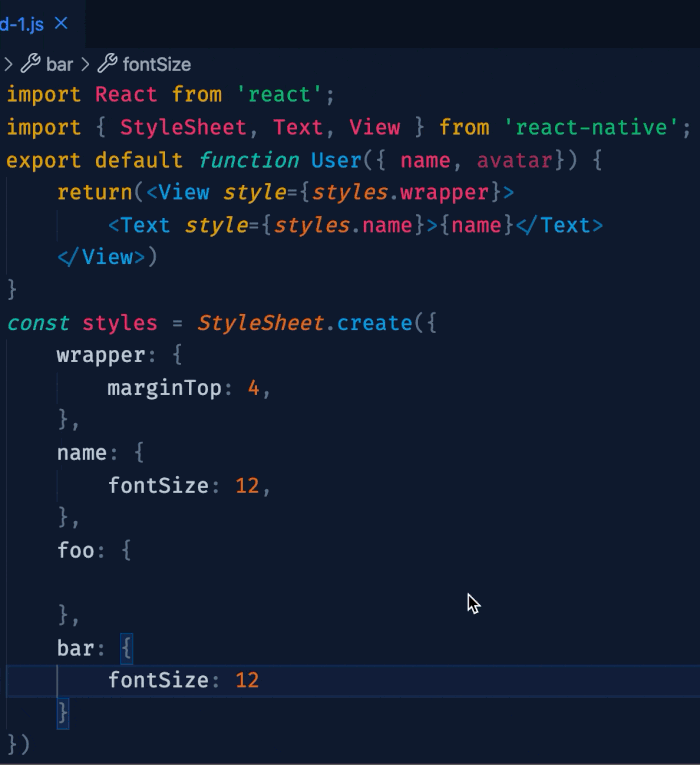

最近写rn, 发现代码中有很多样式都没有用到，可是手动的去`ctrl+f`搜索再删除比较麻烦，于是就萌生了一个写插件的想法，[项目地址](https://github.com/yiuyiu/blog).
## 项目准备
1. 脚手架搭建
```shell
npm install -g yo generator-code
```
脚手架生成过程中，其中`identifier`和`description`的作用如下。
   - identifier 就是你插件的名字，即最后发布到市场的名字。
   - description 就是市场内插件名称下面的描述。
 
官网给出的示例中是否打包webpack是`false`, 所以这边跟着官方走了先选择了`false`.
2. 项目运行与调试
在编辑面板，按`F5`会编译项目打开一个新窗口，在这个新窗口里可以执行在项目中新增的命令，展示新主题，调试打断点等。入口函数`activate`，当插件被激活的时候会执行这个函数内的内容。
3. 发布前准备
   - 安装`vsce`. 用于打包、发布、管理包应用
     ```shell
       npm install -g vsce
     ```
   - 更新`package.json`
     `repository`字段用于指定对应的git地址，icon字段用于设置插件在市场中的小图标
       ```json
           "repository": {
               "type": "git",
               "url": "https://github.com/yiuyiu/vscode-remove-unused-style"
           },
           "icon": "images/kumamon.jpg"
       ```
   - [创建personal access Tokens](https://code.visualstudio.com/api/working-with-extensions/publishing-extension#get-a-personal-access-token)
   - [创建发布者](https://marketplace.visualstudio.com/manage)
       创建好后需要同时在`package.json`中添加`"publisher"`, 即你在插件市场中显示的作者姓名。
       ```shell
          vsce login <publisher name>
       ```
       上面命令可以用于测试token是否有效
    
## 项目实现
插件功能大致如图

- 检测`StyleSheet.create`创建的变量比如`styles`.
  我查了下vscode没有把ast暴露出来给用户，所以这里借用了[@babel/parser](https://babeljs.io/docs/en/next/babel-parser.html)来解析代码。
- 再提取`StyleSheet.create`参数的key值，比如`property1`.
  同样可以借用[@babel/parser](https://babeljs.io/docs/en/next/babel-parser.html)，将这些property1存储到一个数组中。
- 检测`styles.property1`是否在页面中使用，没有的话记录下对应的key值。
  这步骤没有找到更好的实现，目前采用的是全局字符串搜索匹配，将待删除的行数的开始和结束放到另一个数组中。
- 调用vscode提供的api执行删除对应行，并且弹窗提示删除的行数。

## 项目发布以及更新
```shell
vsce publish
```
可以用于发布项目，发布完后需要等到几分钟的验证之后就可以在市场搜到自己的插件了。
更新可以根据[语义化版本](https://semver.org/)
```shell
vsce publish minor
vsce publish patch
vsce publish major
```
或者直接填版本号即可。
## 优化点
- 全局匹配的方法目前采用的是`indexOf`判断，是否有更优雅的实现
## 参考
[官方文档](https://code.visualstudio.com/api/get-started/your-first-extension)